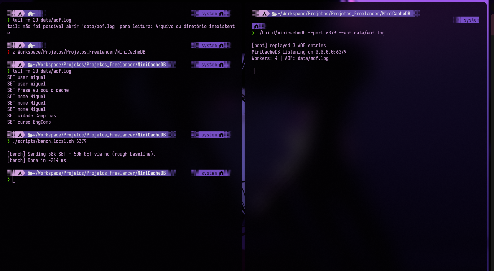

# MiniCacheDB (C++)
<p align="center">
  <b>Um “mini Redis” didático:</b> servidor TCP de chave-valor (SET/GET/DEL) com testes, concorrência e persistência em arquivo (AOF).
</p>

<p align="center">
  
  
  
  
</p>

---

## O que é isso, em linguagem bem simples
O **MiniCacheDB** é um programa que você liga e ele vira um **serviço na rede**.

Ele funciona como um **caderninho digital**:

- você manda **comandos por rede** (mesmo no seu PC ou de outro computador),
- ele **guarda** pares do tipo `chave -> valor` na memória (RAM),
- e salva um “diário” em arquivo (**AOF**) para recuperar os dados quando o servidor reinicia.

👉 É a mesma ideia do Redis (em miniatura), feita do zero para portfólio.

---

## Como funciona por dentro (mapa mental)
```
Cliente (nc / Python / Windows)  --->  TCP (porta 6379)
                                     |
                                     v
                              Parser de comandos
                             (PING/SET/GET/DEL)
                                     |
                                     v
                          KV Store em memória (RAM)
                                     |
                                     v
                    AOF (append-only file): data/aof.log
          (cada SET é gravado e pode ser “reexecutado” no boot)
```

---

## Features
- **Servidor TCP** (sockets POSIX) com protocolo simples de linha
- **Thread pool** (vários clientes/requests simultâneos)
- **KV Store em memória** (`unordered_map`)
- **TTL opcional**: `SET chave valor EX <segundos>`
- **Persistência AOF**: grava comandos em `data/aof.log` e faz replay ao iniciar
- **Testes automatizados** (`ctest`) sem dependências externas
- **Sanitizers** opcionais (ASan/UBSan) via CMake

---

## Começando rápido (Linux)
### Build + testes
```bash
cmake -S . -B build -DCMAKE_BUILD_TYPE=Release
cmake --build build -j
ctest --test-dir build --output-on-failure
```

### Rodar o servidor
```bash
./build/minicachedb --port 6379 --aof data/aof.log
```

Se aparecer `MiniCacheDB listening on 0.0.0.0:6379`, ele está rodando e esperando conexões.

---

## Como usar na prática (exemplos bem “mão na massa”)

### 1) Teste local (mesmo PC)
Em outro terminal:
```bash
printf "PING
SET user miguel
GET user
DEL user
GET user
QUIT
" | nc 127.0.0.1 6379
```

Saída esperada:
```txt
OK
OK
miguel
OK
(nil)
OK
```

**Tradução humana:**
- `SET` guarda
- `GET` lê
- `DEL` apaga
- `(nil)` significa “não existe”

---

### 2) Persistência (AOF): “desliga e liga e continua lá”
Depois de mandar alguns `SET`, veja o arquivo:
```bash
tail -n 20 data/aof.log
```

Exemplo:
```txt
SET user miguel
SET cidade Campinas
SET curso EngComp
```

Reinicie o servidor (Ctrl+C e rode novamente):
```bash
./build/minicachedb --port 6379 --aof data/aof.log
```

No boot, você verá algo como:
```txt
[boot] replayed 3 AOF entries
```

Isso significa: **ele leu o AOF e reexecutou os comandos** para reconstruir o estado.

> Observação: AOF é “histórico”. Se você fez `DEL` e isso estiver no AOF, ao reiniciar ele vai apagar de novo durante o replay.

---

### 3) Conectar a partir de outro computador (Windows) ✅
Se o servidor estiver no Linux com IP `192.168.0.102` (exemplo), no Windows:

**1) Testar se a porta está acessível**
No CMD:
```bat
powershell -Command "Test-NetConnection 192.168.0.102 -Port 6379"
```

Se aparecer `TcpTestSucceeded : True`, conectou.

**2) Enviar comandos por rede (Python no Windows)**
```bat
python -c "import socket; s=socket.create_connection(('192.168.0.102',6379)); s.sendall(b'PING
SET nome Miguel
GET nome
QUIT
'); data=b''; 
while True:
    c=s.recv(4096)
    if not c: break
    data+=c
print(data.decode(errors='ignore')); s.close()"
```

Ou seja: você **controla seu “mini banco” via rede**.

---

## Benchmark rápido (número para portfólio)
Com o servidor rodando:
```bash
./scripts/bench_local.sh 6379
```

Exemplo:
```txt
[bench] Sending 50k SET + 50k GET via nc (rough baseline).
[bench] Done in ~214 ms
```

---

## Comprovações visuais (prints reais)

<p align="center">
  
</p>

---

## Estrutura do projeto
```
MiniCacheDB/
  src/
    core/  (KV store, protocolo, thread pool, AOF)
    net/   (TCP server)
  tests/
  scripts/
```

---

## Limitações (honesto e profissional)
- Protocolo simples de linha (não é RESP completo)
- Um cliente pode ocupar um worker (ok para MVP; dá para evoluir)
- Sem autenticação/criptografia (use apenas em LAN/ambiente de testes)

---

## Roadmap (upgrades “wow”)
- LRU eviction + limite de memória (cache real)
- Melhorar modelo de concorrência (não prender thread por conexão)
- RESP-like protocol + pipelining
- Métricas (/metrics) e latência p95
- Snapshots + AOF rewrite

---

## Licença
Escolha uma licença (MIT/Apache-2.0) antes de publicar.
